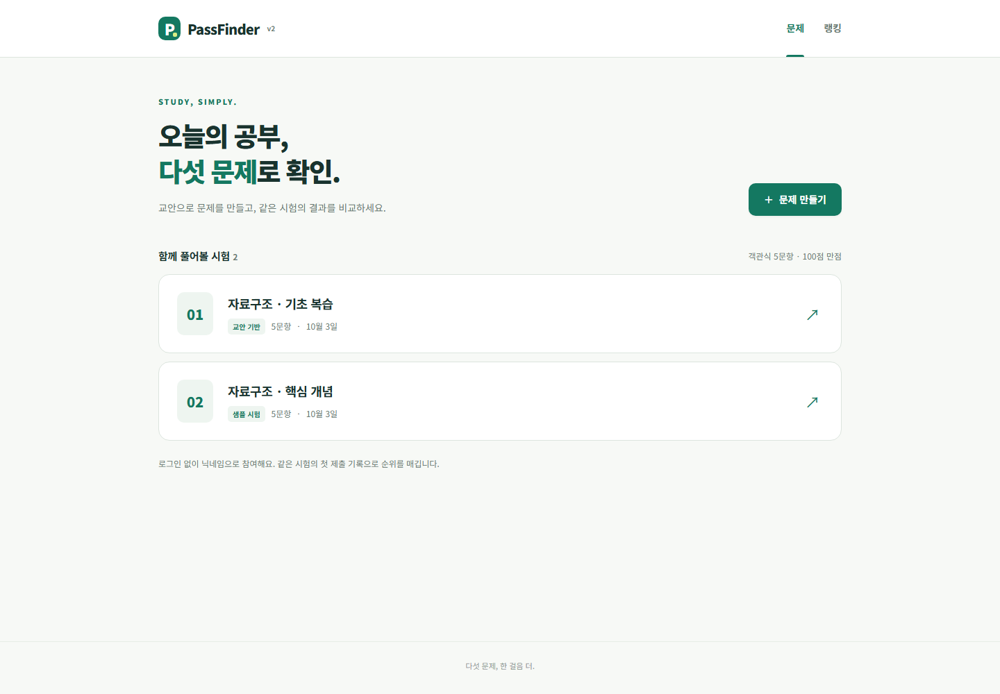
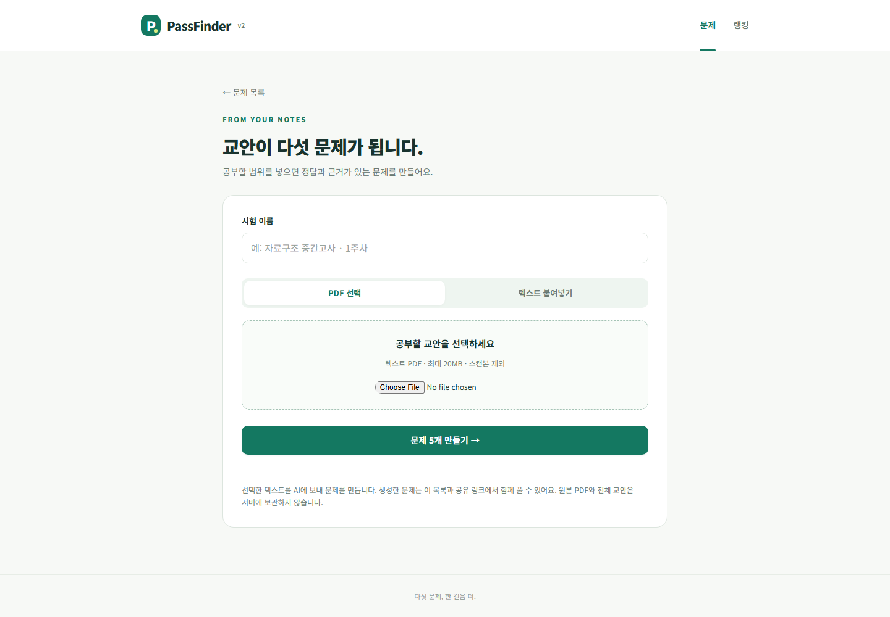
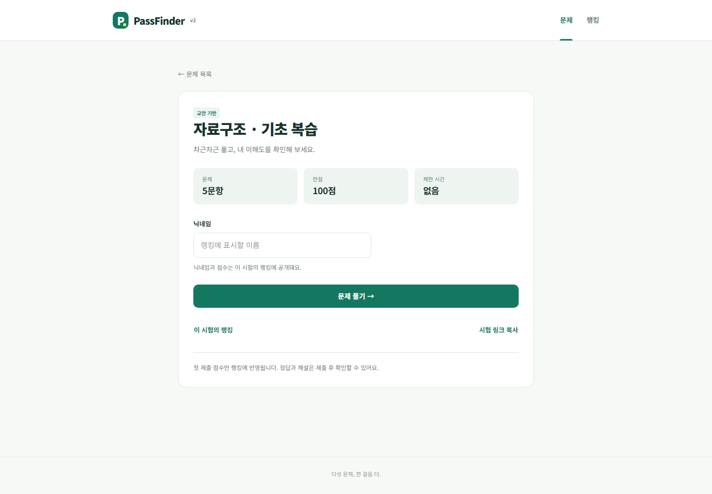
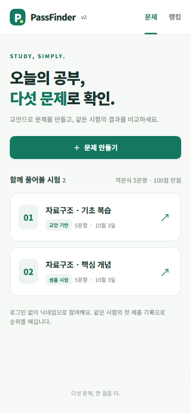
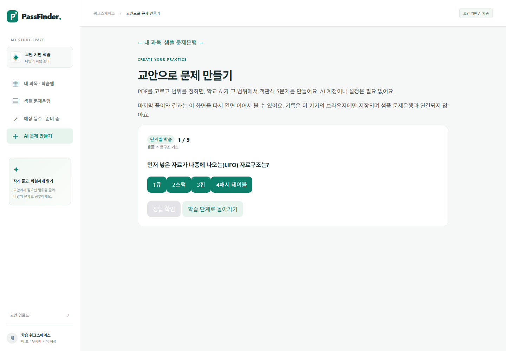
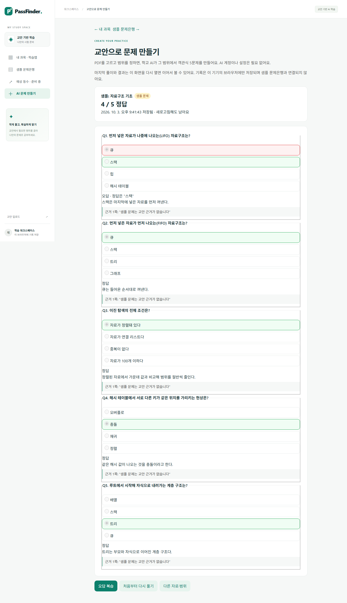
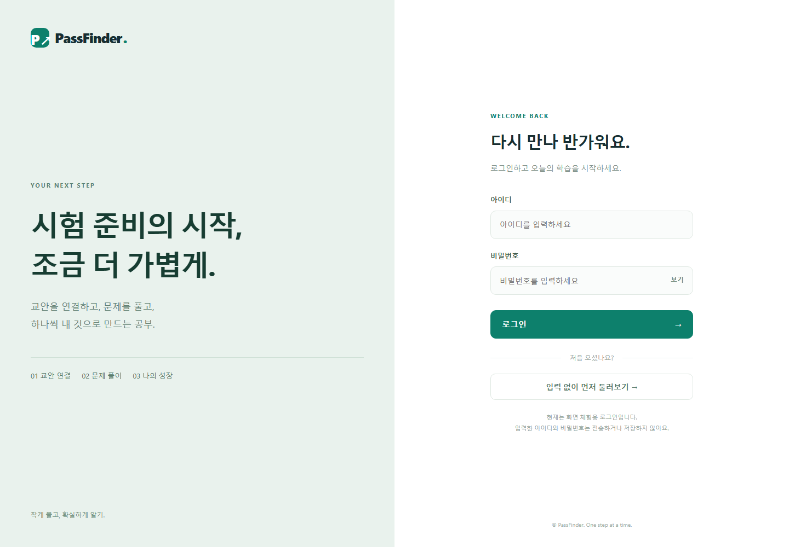
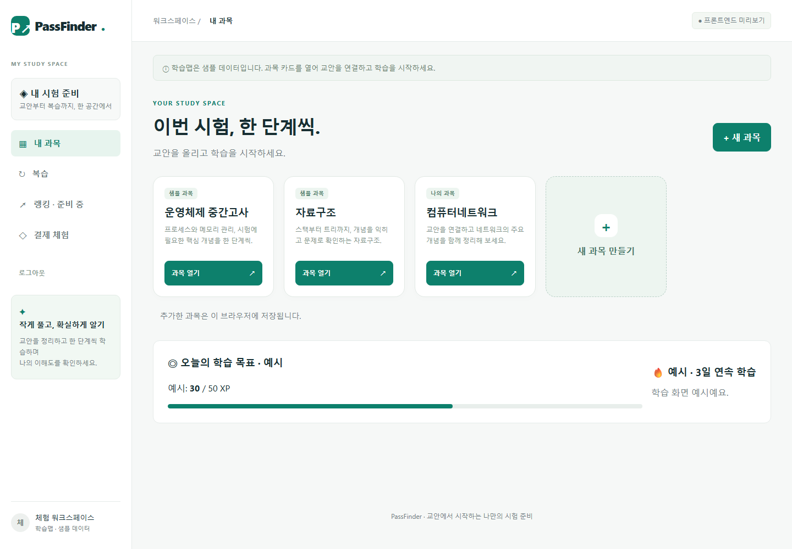
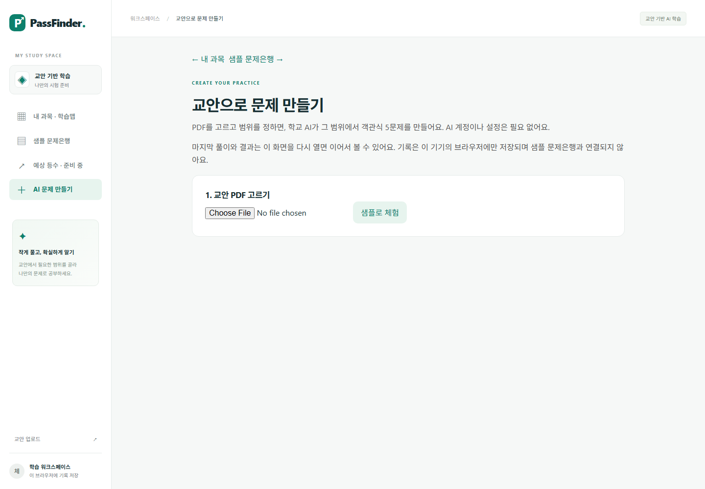

# PassFinder

교안 PDF에서 공부할 범위를 골라 객관식 5문제를 만들고, 풀이·해설·오답 복습으로 이해도를 확인하는 학습 서비스다. 학생의 개인 AI 계정 설정 없이 서버가 학교 AI를 호출한다.

2026 국민대 AI 빌더 챌린지의 **AltTab 팀 프로젝트**다. 이 저장소는 [팀 원본](https://github.com/Snow0821/AltTab)의 개인 계정 보존본이며, 팀 공동 작업을 개인 단독 개발로 표시하지 않는다.

**[v2 체험](https://alt-tab-mu.vercel.app/v2/) · [제출 당시 학습 화면](https://alt-tab-mu.vercel.app/study/make.html) · [전체 화면 기록](#화면-기록) · [로컬 실행](#로컬-실행)**

배포 서버와 외부 AI·DB 연결은 중단될 수 있다. 아래 이미지는 **2026-10-03 공개 배포 화면을 직접 캡처한 기록**이며, 저장소에 포함되어 서비스 접속 없이 볼 수 있다. 캡처 시점의 화면을 보존하며 이후 서비스 상태까지 보장하지 않는다.



## 현재 구현 범위

| 구분 | 학습 흐름 | 저장과 한계 |
|---|---|---|
| 제출 당시 개인 학습 `/study/make.html` | 텍스트 PDF 선택 → 최대 20쪽 → AI 객관식 5문제 → 풀이·해설 → 오답 복습 | 문제와 풀이 기록은 해당 브라우저에 저장. 기기 간 동기화 없음 |
| 후속 v2 `/v2/` | PDF 또는 텍스트 → 문제 생성 → 닉네임 참여 → 서버 채점 → 같은 시험의 순위 비교 | Supabase에 시험과 응시 결과 저장. 브라우저별 첫 제출을 집계하며 닉네임은 계정 인증이 아님 |
| 첫 화면 `/` | 체험용 로그인 → 과목·학습맵 화면 | 실제 회원 인증이 아님. 학습맵·XP·연속 학습은 예시이며 결제는 체험 화면 |

제출 범위의 기준은 동결된 [PRD](passfinder-prd.md)다. 당시 다음 단계로 남겼던 공유·비교와 이후 추가된 v2를 구분한다. v2의 API·저장·순위 규칙은 [v2 설계](docs/v2.md)를 따른다.

이번 화면 보존에서는 배포 v2 목록·생성 입력·응시 안내를 확인했고, 기존 학습 화면의 **샘플** 5문제를 직접 풀어 채점과 오답 복습을 확인했다. 새로운 AI 생성, v2 응시 제출, DB 쓰기 검증은 수행하지 않았다. 샘플 풀이 결과를 모델 정확도나 실제 학생 성과로 해석하지 않는다.

## 화면 기록

출처는 각 항목의 배포 주소다. 원본 PNG와 [캡처 시각·크기·SHA-256 기록](docs/screenshots/manifest.json)을 함께 보관한다. 데스크톱은 1440px, 모바일은 390px 너비에서 캡처했다.

### v2 문제 만들기

[생성 화면](https://alt-tab-mu.vercel.app/v2/?view=create)은 PDF 선택과 텍스트 붙여넣기를 제공한다. 아래는 생성 전 입력 화면이며 AI 호출 결과가 아니다.



<details>
<summary>v2 응시 안내와 모바일 목록 보기</summary>

시험을 고르면 문제 수·배점·닉네임 공개 범위를 안내한다. 캡처에서는 닉네임 입력과 응시 시작을 하지 않았다.



모바일 [시험 목록](https://alt-tab-mu.vercel.app/v2/)에서는 교안 기반 시험과 샘플 시험을 구분한다.



</details>

### 개인 학습의 풀이와 복습

[문제 만들기 화면](https://alt-tab-mu.vercel.app/study/make.html)의 `샘플로 체험`을 사용했다. 아래 문제와 점수는 준비된 샘플을 직접 푼 결과이며 학교 AI를 새로 호출한 결과가 아니다.



<details>
<summary>샘플 채점 결과와 오답 복습 보기</summary>

5문제 중 4문제를 맞히고, 틀린 1문제만 다시 푸는 흐름을 확인했다. 해설과 샘플 표시가 함께 보인다.




</details>

<details>
<summary>첫 화면·과목 화면·PDF 선택 보기</summary>

[첫 화면](https://alt-tab-mu.vercel.app/)은 화면 체험용 로그인이다. `입력 없이 먼저 둘러보기`로 진행할 수 있다.



과목·학습맵 화면의 XP와 연속 학습은 예시다. 실제 이용자 활동 수치가 아니다.



[개인 학습 화면](https://alt-tab-mu.vercel.app/study/make.html)에서 PDF를 선택하거나 샘플을 열 수 있다.



</details>

## 구현과 판단

- **브라우저에서 PDF 텍스트 추출:** 원본 PDF 대신 선택한 범위의 텍스트를 서버로 보내 문제를 생성한다. 스캔 PDF는 지원하지 않는다.
- **근거 검사:** 정답·선택지·해설 형식과 교안의 근거 인용을 검사한다. 인용 존재 검사가 정답의 의미적 정확성까지 보장하지는 않는다.
- **제출 전 정답 분리:** v2는 제출 전에 정답·해설을 응답에서 제외하고 서버에서 채점한다.
- **첫 제출 비교:** v2는 시험별·브라우저별 첫 제출만 집계하고, 같은 점수는 공동 순위로 표시한다. 쿠키를 지우거나 다른 브라우저를 쓰면 별도 참가자로 인식할 수 있다.
- **저장 방식 구분:** 기존 학습 결과는 브라우저, 기존 파일 업로드는 Vercel 임시 디스크, v2 시험·응시는 Supabase를 사용한다. 모든 데이터가 재배포 시 사라지는 구조는 아니다.

## 담당 범위

5인 팀 중 이 계정이 맡은 부분이다. 커밋은 [팀 원본](https://github.com/Snow0821/AltTab)의 기록이다.

| 영역 | 한 일 | 근거 |
|---|---|---|
| 배포 장애 진단 | 팀 배포 주소가 첫 화면부터 서버 오류로 열리지 않았다. 같은 코드를 별도 배포에 올려 런타임 로그로 원인(읽기 전용 디스크에 업로드 폴더 생성)을 찾고, 업로드를 임시 폴더로 옮겼다 | [fe5bd85](https://github.com/Snow0821/AltTab/commit/fe5bd85), [PR #8](https://github.com/Snow0821/AltTab/pull/8) |
| 교안 기반 문제 생성 | 학생이 개인 AI 계정 없이 쓰도록 서버가 학교 AI로 객관식 5문제를 만든다. 형식·근거 문장 검사를 통과한 문항이 5개 미만이면 가짜 문제 대신 실패로 알린다. 브라우저 저장, 같은 범위 재생성 방지, 중복 클릭 차단, 오답 복습 | [cef0a8a](https://github.com/Snow0821/AltTab/commit/cef0a8a) |
| 요구사항과 배포 일치 | 심사 AI가 PRD와 배포 주소를 대조하므로, 배포에서 확인되지 않은 공유·비교 기능을 다음 단계로 내리고 PRD·발표·사용 매뉴얼을 실제 서비스에 맞췄다 | [a19ea5c](https://github.com/Snow0821/AltTab/commit/a19ea5c), [33b26e1](https://github.com/Snow0821/AltTab/commit/33b26e1) |
| 배포 주소 검증 | 자료 2개 각 5문제, 근거 문장이 해당 자료에만 있는지, 새로고침 유지, 실패 후 재시도, 연타 시 요청 1회 등 12항목을 휴대폰 폭(390px)에서 두 번 통과 | [PRD 8절](passfinder-prd.md) |

화면·UI, DB 연결 점검, 세트 저장·채점 API, 초기 MCP 시도는 다른 팀원이 맡았다.

## 대회 뒤 후속 작업

제출 뒤 이어서 만든 작업이다. 모두 `main`에 합치지 않은 브랜치이고, 배포 서비스에는 들어가지 않았다.

| 브랜치 | 내용 | 상태 |
|---|---|---|
| [`fix/ai-question-quality`](https://github.com/wpalswpa/AltTab/tree/fix/ai-question-quality) | 글자 검사만으로는 틀린 정답·복수 정답·반대 해설을 통과시키는 문제를 합성 사례 4개로 재현했다. 정답과 해설을 숨긴 채 같은 모델이 다시 풀게 해 정답이 일치할 때만 내보내고, 호출 6회·전체 110초 상한을 두었다. 설계는 [문항 품질 문서](https://github.com/wpalswpa/AltTab/blob/fix/ai-question-quality/docs/ai-question-quality.md) | 가짜 AI 서버로 39개 테스트 통과. 실제 모델 호출과 정답률 측정은 하지 않았다 |
| [`fix/study-answer-recovery`](https://github.com/wpalswpa/AltTab/tree/fix/study-answer-recovery) | 풀던 답을 잃지 않게 보존하고, 브라우저 저장 실패를 사용자에게 알린다 | 미배포 |
| [`docs/business-claims-check`](https://github.com/wpalswpa/AltTab/tree/docs/business-claims-check) | 가격·원가·검수 조건 같은 사업 주장을 코드와 대조해, 확인된 것과 아직 가정인 것을 나눴다 | 문서 |

[사업화 재설계](docs/business-redesign.md)는 대회 뒤 심사위원의 서면 피드백을 반영한 검토안이다. 학생이 남의 교안을 올리는 구조의 저작권 문제 때문에, 교수자·교육기관이 자기 자료로 쓰는 B2B 출제 도구로 고객을 바꿨다. 공식 통계로 시장을 추정했더니 대학 판매만으로는 작아서, 출제 기능을 API로 공급하는 매출 축을 함께 두었다. 개인정보 동의·가명 처리, KPI, 단계별 계획도 담았다. 수치는 모두 가정 표시를 붙였고 실제 수요는 확인하지 않았다.

## 로컬 실행

Node.js 18 이상이 필요하다.

```bash
npm ci
npm start
```

`http://localhost:3000/study/make.html`에서 `샘플로 체험`을 선택하면 AI 키 없이 풀이·채점·복습을 확인할 수 있다. `http://localhost:3000/`은 체험용 첫 화면이다. `PORT`로 포트를 지정할 수 있다.

v2의 흐름을 외부 DB·AI 없이 확인하려면 별도 테스트 실행 파일을 사용한다.

```bash
node tests/v2-preview.cjs
```

`http://127.0.0.1:3497/v2/`로 접속한다. 이 실행은 **메모리 저장소와 고정 문제를 사용하는 로컬 데모**다. 재시작하면 기록이 사라지며 실제 AI·Supabase 결과가 아니다. 위 배포 화면 캡처와도 구분한다.

실제 연결에는 서버의 `KOOKMIN_KEY`와 v2 저장용 `SUPABASE_KEY`가 필요하다. v2 저장소는 코드에 지정된 팀 Supabase 프로젝트와 [스키마](supabase/migrations/20261003063714_alttab_v2_exams.sql)를 전제로 한다. 키를 브라우저 코드나 저장소에 넣지 않는다. 이 보존본을 복제하는 것만으로 외부 DB와 학교 AI가 제공되지는 않는다.

## 파일과 문서

| 위치 | 내용 |
|---|---|
| [`server.js`](server.js) | Express 진입점과 기존 서비스 경로 |
| [`ai-generate.js`](ai-generate.js), [`public/exam-workspace/`](public/exam-workspace/) | 제출 당시 교안 기반 생성·개인 학습 |
| [`v2.js`](v2.js), [`v2-ai.js`](v2-ai.js), [`v2-store.js`](v2-store.js), [`public/v2/`](public/v2/) | 후속 v2의 API·생성·Supabase 저장·화면 |
| [`tests/`](tests/) | 동작 검사와 로컬 데모 실행 파일 |
| [`passfinder-prd.md`](passfinder-prd.md) | 제출 당시 요구사항과 범위 |
| [`docs/v2.md`](docs/v2.md) | 후속 v2 설계·API·기존 검증 기록 |
| [`docs/screen-archive.md`](docs/screen-archive.md) | 화면 보존 범위와 확인 기준 |
| [`docs/business-redesign.md`](docs/business-redesign.md) | 대회 뒤 사업화 재설계(권리·개인정보·시장 추정·단계 계획) |
| [`인수인계.md`](인수인계.md) | 제출 당시 운영 구조와 남은 일 |

팀 개발 절차는 [협업 가이드](CONTRIBUTING.md), AI 작업 지침은 [AGENTS.md](AGENTS.md)를 따른다. 기존 [서버·DB 구현 지시](docs/클로드_공통시험_구현지시.md)와 [발표 자료 제작 흐름](docs/presentation/발표제작흐름.md)은 당시 작업 기록으로 보존한다.
