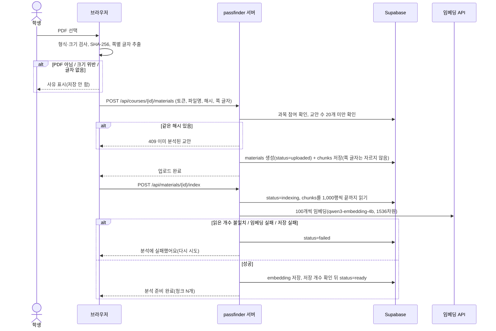
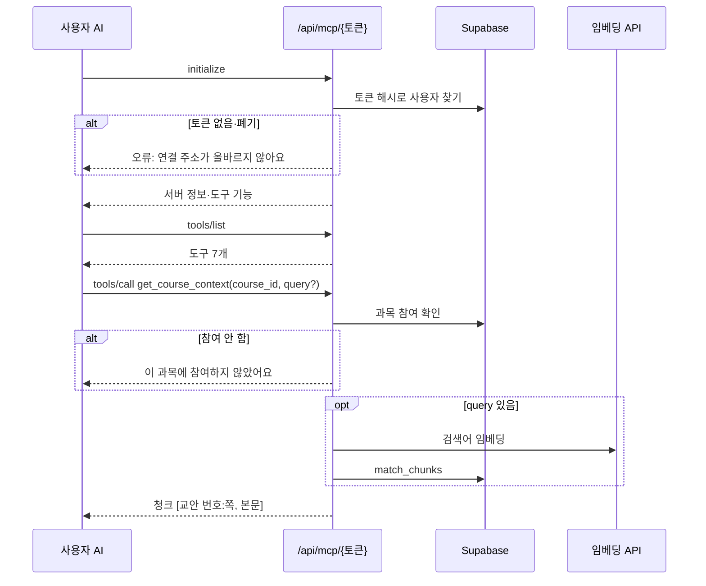
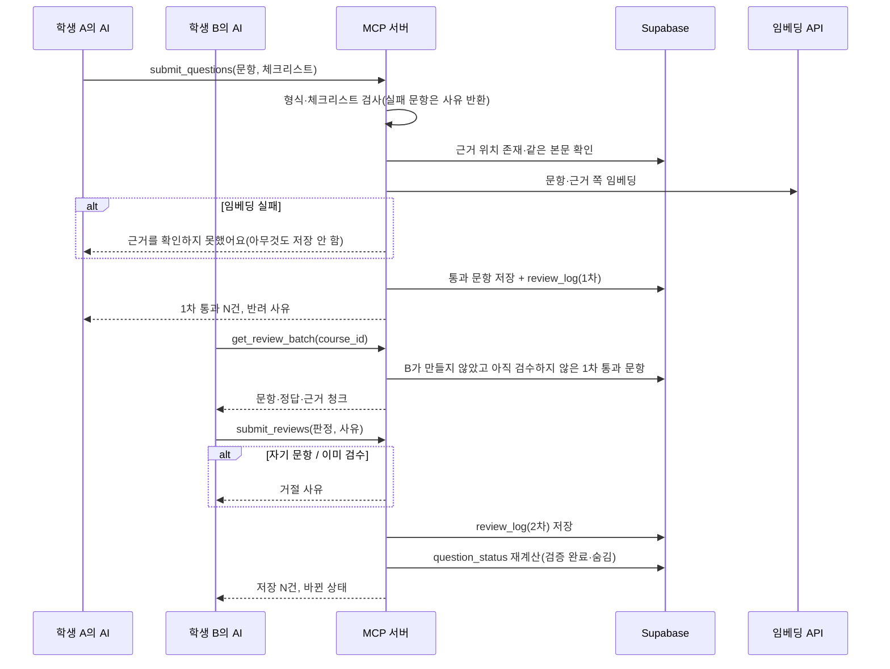
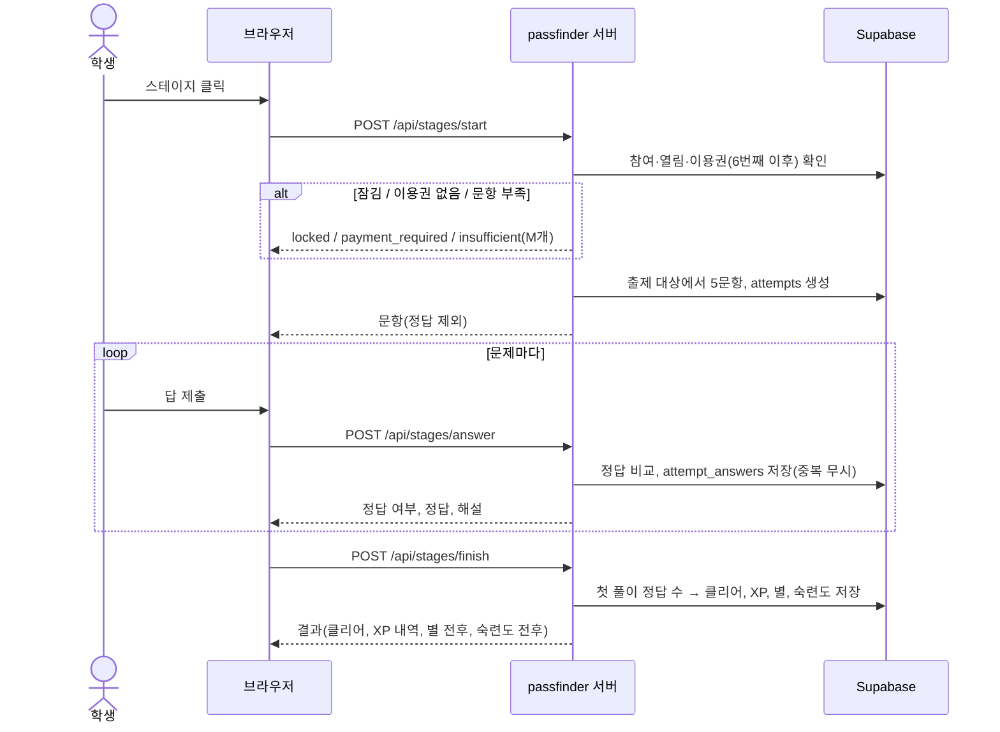
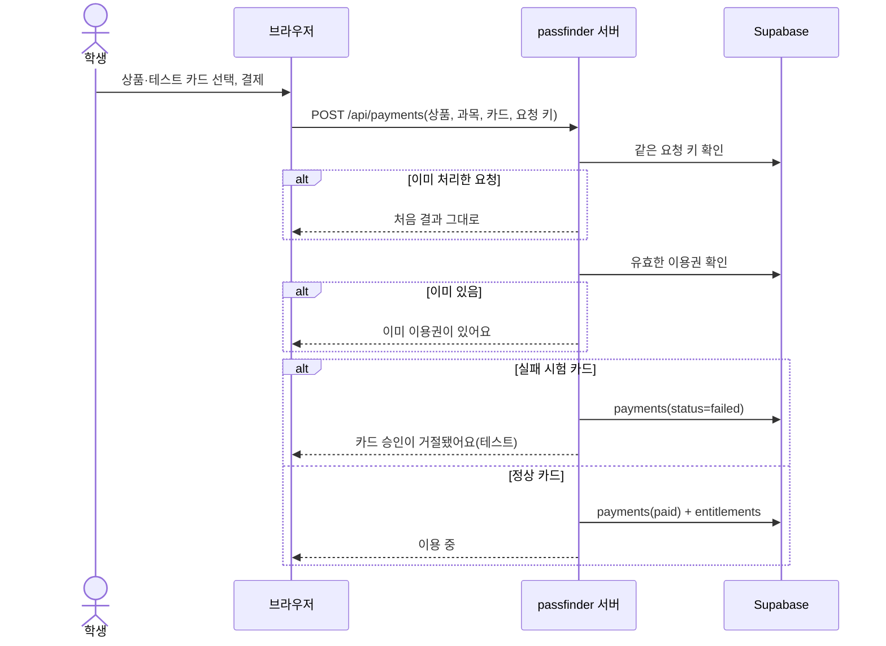
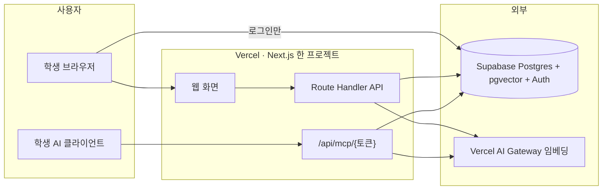

# passfinder 설계서

구현 범위와 완료 기준의 정본은 저장소 루트 `PRD.md`다. 이 문서는 화면·API·데이터·모듈을 정한다. `docs/proposals/PRD-revision.md`는 운영 방향·축소안 참고이며 기존 FR 완료 기준을 대체하지 않는다. 담당과 일정은 `docs/team-work-plan.md`, 실행 스키마는 `supabase/schema.sql`을 따른다.

## 서비스 이름

서비스 이름은 소문자 `passfinder`로 통일한다. 화면 제목·로고·안내·MCP 도구 설명·문서·생성 교안의 서비스 표기에 같은 이름을 쓴다. 보존한 초안은 `passfinder-초안-PRD.md`로 관리하고 현재 구현의 정본은 `PRD.md`로 유지한다.

팀명·저장소명 `AltTab`, 실제 배포 주소, 과거 커밋을 가리키는 출처 주소, 원본 파일의 식별자와 사용자 저장 키는 이름 교체만으로 바꾸지 않는다. 기존 링크와 저장 기록의 호환성을 유지한다. 이름 변경은 기능·요금·데이터 구조를 바꾸지 않는다.

## 1. 문제와 수익모델 검토

### 해결할 귀찮음

- 누가·언제: 교안(PDF) 중심 과목을 듣는 대학생이 시험 1~2주 전부터 시험 전날까지 과목마다 반복한다.
- 반복 작업: ① 교안을 처음부터 읽으며 시험에 나올 개념 고르기 ② 스스로 확인할 문제 만들기 ③ 맞혔는지 채점하기 ④ 틀린 개념을 언제 다시 볼지 기억하기.
- 현재 대안: 교안 직접 정리, AI로 문제 만들기, 족보·선배 자료, Anki·Quizlet. 경쟁 서비스에 저장·퀴즈 기능이 없다고 전제하지 않고 준비·채점·복습 관리 시간을 비교한다.
- passfinder가 대신하는 작업: ②의 저장·재사용, ③ 채점, ④ 진도·복습 순서 관리, 같은 수업 학생 간 문항 공유와 교차 검수 기록.
- 학생에게 남는 작업: 교안 업로드, 웹 생성 요청, 문제 풀이와 결과 확인. 기본 이용에 개인 AI 계정·MCP 연결을 요구하지 않는 것이 목표다. 현재 웹 생성은 첫 유닛에 한정된다.
- 남은 제약: 추가 문항 생성과 교차 검수에 기존 MCP 경로가 남아 있다. 일반 참여자는 검증 완료 또는 본인이 검수 통과시킨 문항만 풀 수 있어 검수 대기가 학습 시작을 막을 수 있다.
- 기본 첫 이용: 가입 → 과목 만들기 → PDF 올리기 → 웹 첫 유닛 생성 → 풀이. 생성한 학생은 1차 통과 문항을 사용할 수 있다. 친구의 즉시 풀이는 같은 개념·난이도의 검증 완료 문항이 5개 이상 있을 때 가능하다.

### 돈을 내는 이유

- 사용자 = 구매자 = 학생 본인. 학과·교수는 이번 범위의 구매자가 아니다.
- 지불 이유(가설): 운영자가 서버 생성 비용을 부담하고 학생은 교안 기반 문제 준비·채점·진도·복습 관리 시간을 줄이는 데 값을 지불한다. 기존 공부 방식보다 줄어든 작업과 시간, 문항 오류율을 확인해야 한다.
- 학점에 대한 관심과 효용의 구분: 학점이 오른다는 주장은 하지 않는다. 확인할 수 있는 효용은 "시험 범위 스테이지를 끝까지 풀었다", "틀린 개념을 다시 풀었다"이다.
- 핵심 유료 가치 하나: 6번째 스테이지부터 이어서 푸는 권리(검수 문항 + 진도·복습 관리).
- 첫 결제 전 체험: 과목마다 첫 유닛(스테이지 5개)과 문제 만들기·검수는 무료.
- 현재 상품: 과목 1회 2,900원과 모든 과목 30일 9,900원. 3과목은 8,700원, 4과목은 11,600원이라 가격만 비교하면 4과목부터 30일 상품이 저렴하다. 과목 이용권의 기간 제한 없음과 30일 제한을 구분한다. 월 2,900원 제안과 현재 상품의 불일치는 후속 정합화가 필요하다.
- 가격·구매 의향은 모두 가설이다. 실제 결제는 이번 제출 범위에 없다(모의 결제).

### 제공 원가

PRD 9절의 원가 항목을 따른다. 계산 근거만 여기에 둔다.

| 항목 | 값 | 종류 |
| --- | --- | --- |
| 임베딩 단가 | 100만 토큰당 0.02달러(qwen3-embedding-4b) | Vercel AI Gateway 모델 목록(2026-10-03 확인) |
| 교안 100쪽 색인 | 쪽당 500토큰 × 100쪽 = 5만 토큰 → 약 0.001달러 | 가정 + 계산 |
| 문항 근거 확인 | 문항 1개 약 300토큰 → 50문항 1.5만 토큰 → 약 0.0003달러 | 가정 + 계산 |
| 운영자 검수였다면 | 30초 × 50문항 = 25분 × 10,320원/60분 ≈ 4,300원 | 가정 + 계산 |
| 운영자 검수, 같은 과목 N명 공유 | 4,300 ÷ N원/인 (N=2면 2,150원, N=5면 860원) | 계산 |
| 결제 수수료 | 3%대 가정 → 2,900원당 약 100원 | 가정(미확인) |
| 고정비 | 무료 요금제로 시작, 상용 전환 시 Supabase Pro 월 25달러~ | 공식 가격 |

서버 생성·임베딩·재시도·무료 이용량·저장·오류 대응을 포함한 총원가는 미측정이다. 운영자가 API 비용을 부담하며 학교 지원 크레딧을 상용 원가 0원의 근거로 쓰지 않는다. 기존 학생 AI 검수의 시간 부담도 남아 있다. 과목 이용권은 1회 결제이므로 활성 사용자 수를 월 구독 매출로 계산하지 않는다.

### 초기 유입과 반복 이용

- 첫 고객 가설: 교안 중심 전공 기초 과목의 스터디 1개(4~6명). 개인 AI 보유 여부와 무관하게 웹 생성·첫 풀이를 수행할 수 있는지 관찰한다.
- 데려오는 경로: 과목을 만든 학생이 참여 코드를 스터디 단체방에 공유한다. 첫 사용자는 혼자서도 자기 1차 통과 문항으로 바로 풀 수 있어, 친구가 오기 전에도 가치가 있다.
- 다시 올 이유: 같은 과목 기말고사(문항이 이미 쌓여 있음), 복습 필요 스테이지(FR-08, 선택).

### 주제 부합과 수익화를 함께 보는 판단

- 현재 제약: 웹 생성은 첫 유닛 5개 개념·25문항까지다. 전체 유료 학습 범위의 개인 AI 필수 제거가 완료된 것은 아니다. 생성 실패·검수 대기·추가 문항 확보를 함께 확인한다.
- 시연 조건: 실제 웹 생성과 검사 결과를 확인한 문항을 사용한다. 공동 체험 과목은 작성자 외 두 검수자의 통과 조건을 충족해야 한다. 준비된 체험 과목과 새 교안 생성은 구분해 시연한다.
- 후속 정합화: 개인 AI 없이 추가 문항과 공유 검수를 이용하는 경로, 유료 범위의 충분한 문항 확보, 가격안 통일이 필요하다. 이번 문서 수정은 이 기능들이 완료됐다는 뜻이 아니다.

### 오늘 확보할 근거 (연락·발송은 팀이 직접 한다)

| 순서 | 질문·과제 | 기록할 증거 종류 |
| --- | --- | --- |
| 1 | 최근 시험을 어떻게 준비했나요? 교안 정리·문제 풀이에 하루 몇 시간 썼나요? | 인터뷰 답변 |
| 2 | 시험 자료(족보·강의·문제집)에 돈을 낸 적이 있나요? 얼마였나요? | 인터뷰 답변(과거 행동) |
| 3 | 과제: 배포 주소에서 가입 → 참여 코드로 데모 과목 참여 → 스테이지 1 풀기 | 실제 사용 관찰(걸린 시간, 막힌 단계) |
| 4 | 과제: 개인 AI 계정 없이 웹에서 교안을 올리고 첫 유닛 생성·풀이하기 | 실제 사용 관찰(시간·실패·재시도·문항 오류) |
| 5 | 6번째 스테이지부터 2,900원이면 결제하겠나요? 얼마면 하겠나요? | 구매 의향(실제 결제 아님) |

인터뷰 답변, 구매 의향, 실제 결제는 서로 다른 증거로 적는다. 오늘은 실제 결제를 받을 수 없다.

### 요약표

| 문제 | 현재 대안 | 대신할 작업 | 유료 가치 | 구매자 | 가격 가설 | 제공 원가 | 유입 경로 | 검증 방법 |
| --- | --- | --- | --- | --- | --- | --- | --- | --- |
| 교안에서 시험 대비 문제를 만들고 채점·복습하기가 귀찮다 | 직접 정리, AI 문제 생성, 족보, Anki | 웹 생성·저장·채점·진도·복습 관리 | 준비·복습 시간 절약(가설) | 학생 본인 | 과목 1회 2,900원 / 30일 9,900원 | 운영자 부담 API·저장·지원·수수료, 총원가 미측정 | 스터디 참여 코드 | 팀 외 학생 사용 관찰·가격 반응 |

## 2. PRD 모순과 구현 위험

PRD 수정으로 처리한 항목은 PRD 부록 2에 있다. 여기에는 모든 항목의 심각도와 확인 방법, 그리고 PRD를 바꾸지 않고 구현·운영에서 막는 위험을 둔다.

| # | 문제 | 심각도 | 영향 FR | 최소 수정안 | 확인 방법 | 처리 |
| --- | --- | --- | --- | --- | --- | --- |
| 1 | 결제 전 MCP 차단과 첫 유닛 무료 충돌 | 높음 | 02, 06 | MCP 무료, 이용권은 6번째 스테이지부터 | 이용권 없는 계정으로 도구 호출·스테이지 6 클릭 | PRD 부록 2-1 |
| 2 | 과목 합류 방법 없음(2차 검수 불가) | 높음 | 01, 03 | 6자리 참여 코드 | 두 번째 계정으로 참여 | PRD 부록 2-2 |
| 3 | 2차 검수가 유닛을 잠금 | 중간 | 03, 05 | 잠금 대신 출제 대상 추가 | B 계정에서 검수 전후 출제 문항 수 비교 | PRD 부록 2-3 |
| 4 | 주관식 유사도 0.6 오판(측정 7/9) | 높음 | 05 | ★3 단답형 + 허용 답안 | 반대 답·빈 답 제출 | PRD 부록 2-4 |
| 5 | 이전 서비스 이름·운영자 문구 잔존 | 중간 | 전체 | 명칭·문구 통일 | 실제 주소·원본 식별자를 제외한 서비스 표기가 소문자 passfinder이며 운영자 승인 문구 없음 | PRD 부록 2-5·6 |
| 6 | 원가 주장 부정확, 1% 매출 근거 없음 | 중간 | 9절 | 원가 항목 보완, 가설 표시 | 이 문서 1절 계산표 | PRD 부록 2-7 |
| 7 | 교안 여러 개일 때 근거 쪽 모호 | 중간 | 02, 03 | "교안 번호:쪽" | 교안 2개 과목에서 근거 "2:3" 제출 | PRD 부록 2-8 |
| 8 | "기준 미만"·"거의 같으면" 수치 없음 | 중간 | 03 | 0.25, 정규화 본문 일치 | 근거가 다른 문항·같은 문항 제출 | PRD 부록 2-9 |
| 9 | 근거 유사도는 정답 여부를 보장하지 않음 | 중간 | 03 | 화면·PRD에 "근거 쪽 관련성"으로만 설명, 정답 검증은 1·2차 AI 검수가 맡음 | 정답만 틀린 문항이 근거 대조를 통과하는지 측정 | 설명 문구로 처리 |
| 10 | 중요도를 출제 확률처럼 읽힐 위험 | 낮음 | 04, 10 | "교안에서 다루는 분량 비율"로 정의 | PRD 4절 문구 | PRD 4절 |
| 11 | 서버가 AI가 보낸 사용자·정답을 믿을 위험 | 높음 | 02, 03, 05 | 사용자는 토큰으로만 식별, 정답은 제출 전 화면에 보내지 않음, 자기 문항 검수 거절 | 도구 인자에 다른 사용자 ID를 넣어도 무시되는지, 문제 응답에 정답 필드가 없는지 확인 | 구현 규칙(6절) |
| 12 | Claude Desktop 사용자 지정 커넥터의 요금제별 허용 범위 미확인 | 중간 | 02 | Claude Code로 먼저 검증, Desktop은 배포 후 시험 | `claude mcp add --transport http` 연결, Desktop 등록 | 배포 후 확인 |
| 13 | 50MB PDF·120초 색인 | 중간 | 01 | 브라우저에서 글자 추출, 임베딩 100개씩 묶어 호출, 실패 시 다시 시도 | 30쪽·200쪽 PDF로 시간 측정 | 구현 규칙 |
| 14 | AI Gateway 무료 등급의 모델 제한(OpenAI 임베딩 403 실측)과 호출 제한(429) | 높음 | 01, 03 | 무료 등급에서 호출되는 qwen3-embedding-4b 사용, 실패 시 "다시 시도", 문항 제출은 저장 없이 재시도 안내 | `scripts/embed-models-check.ts`, 연속 업로드 시험 | 모델 교체(PRD 부록 2-13) |
| 15 | 이메일 확인 메일 발송 제한, 확인 생략에 따른 대량 가입·남의 이메일 선점 | 높음 | 01 | 서버에서 확인 완료 상태로 계정 생성, 접속 주소별 1시간 60회 제한. 남의 이메일 선점은 막지 못함(상용 전환 시 확인 메일 사용) | 새 이메일로 가입 즉시 로그인, 같은 주소에서 61번째 시도 429 | 구현 규칙 + 남은 위험 |
| 16 | 한 사람이 계정 2개로 스스로 검증 | 낮음 | 03 | 참여 코드로 범위 축소, 약점으로 공개 | PRD 4절 | 남은 위험 |
| 17 | 교안 저작권: 공유 문항이 교안 내용을 옮길 수 있음 | 중간 | 03 | PDF 원본 미보관, 같은 수업 참여자 안에서만 공유. 법률 판단은 하지 않았음 | 발표 질의 대비 | 남은 위험 |
| 18 | Vercel Hobby는 비상업 조건 | 낮음 | 운영 | 대회 시연은 무료 등급, 상용 전환 시 Pro | 약관 재확인 | 남은 위험 |
| 20 | 서버 생성 문항의 정답 오류·무료 등급 호출 제한 | 높음 | 12 | MCP와 같은 1차 검사, 2차 검수 전에는 생성한 학생에게만 출제, 실패 시 저장 없음, 하루 3번 상한 | 체험 교안으로 생성 후 반려 수·근거 점수 확인 | 구현 규칙 |
| 19 | 모의 결제와 결제사 테스트 연동 혼동 | 중간 | 06 | PRD·화면에 "실제 돈이 나가지 않는 모의 결제" 명시 | 결제 화면 문구 | PRD 부록 2-10 |

## 3. DDBM 캔버스

데이터 주도 비즈니스 모델 12칸이다. 각 칸이 근거로 삼는 PRD 위치를 붙였다.

| 칸 | 내용 | PRD |
| --- | --- | --- |
| 개요 | 운영자 서버 AI로 교안에서 문제를 준비하고 웹에서 채점·복습하는 시험 대비 서비스. 현재 웹 생성 범위는 첫 유닛 | 1절 |
| 미션 | 시험 범위를 끝까지 한 번은 확인하고 시험장에 들어가게 한다 | 1·2절 |
| 핵심 활동 | 교안 색인(FR-01), 웹 첫 유닛 생성(FR-12), 기존 MCP 생성·검수(FR-02·03), 스테이지 진행·채점(FR-04·05), 모의 이용권 결제(FR-06) | 5절 |
| 핵심 파트너 | 서버 생성·임베딩 API 제공자, Supabase, Vercel. 사용자 AI 클라이언트는 기존 추가 생성·검수 연동 경로 | 8절 |
| 핵심 장벽 | 첫 유닛 밖의 문항 확보, 교차 검수 대기, 교안 이용 권한, 실제 생성 원가와 지불 의향 | 2절 |
| 가치제안 | 개인 AI 없이 웹에서 첫 문제를 준비하고 채점·학습 진행을 이어 관리한다. 공동 풀이는 검수 조건을 충족한 문항으로 제공한다 | 1·3절 |
| 부정적 영향 | 잘못된 문항이 검증 완료로 공개될 위험, 교안 내용 재배포 위험, AI 검수 토큰을 학생이 부담 | 4절 약점, 2절 표 17 |
| 핵심 이네이블러 | MCP 서버(주소 토큰), 브라우저 PDF 추출, pgvector 검색, 상태 판정 뷰, 모의 결제 | 8절 |
| 핵심 데이터 | 교안 청크·임베딩, 개념·선수 관계, 문항·허용 답안, 검수·신고 기록, 풀이 기록·숙련도 | 8절 테이블 |
| 혜택 | 학생: 정리·출제·채점 시간 절약, 진도 가시화. 과목 공동체: 검증 문항 누적 | 4절 |
| 비용 | 서버 문항 생성·검수 관련 처리·임베딩·인프라·결제 수수료·오류 대응, 실제 총원가 미측정 | 9절 |
| 수익 | 과목 이용권 2,900원, 30일 구독 9,900원(가설), 첫 유닛 무료 | 9절 |

명세 연결: 개요·미션 → PRD 1~3절, 핵심 활동 → FR, 핵심 데이터 → 6절, 핵심 이네이블러 → 7절, 장벽·부정적 영향 → 2절 위험표, 가치제안 → FR 완료 기준, 혜택·비용·수익 → PRD 9절.

## 4. 유스케이스

### 행위자

| 행위자 | 설명 |
| --- | --- |
| 학생(출제자 A) | 과목과 교안을 등록하고 웹 첫 유닛 생성을 요청한다. 기존 MCP 추가 생성도 가능하다 |
| 학생(풀이자·검수자 B) | 참여 코드로 들어와 풀고, 자기 AI로 2차 검수한다 |
| 사용자 AI 클라이언트 | 학생이 쓰는 Claude Desktop·Claude Code. MCP 도구를 호출한다 |
| 임베딩 API | 외부 시스템. 글자를 벡터로 바꾼다 |

운영자는 행위자가 아니다(PRD 3절).

### 목록

| UC | 이름 | 주 행위자 | FR |
| --- | --- | --- | --- |
| UC-01 | 가입·로그인 | 학생 | FR-01 |
| UC-02 | 과목 만들기·참여 코드로 들어가기 | 학생 | FR-01 |
| UC-03 | 교안 올리기·색인 | 학생 A | FR-01 |
| UC-04 | MCP 연결·교안 맥락 조회·개념 등록 | 사용자 AI | FR-02 |
| UC-05 | 문항 제출(1차 검수) | 사용자 AI | FR-03 |
| UC-06 | 2차 검수 | 학생 B의 AI | FR-03 |
| UC-07 | 스테이지 맵 보기 | 학생 | FR-04 |
| UC-08 | 스테이지 풀기·채점·신고 | 학생 | FR-05 |
| UC-09 | 이용권 테스트 결제 | 학생 | FR-06 |

### 명세

| UC | 사전 조건 | 정상 흐름(행위자 → 시스템) | 예외 흐름 | 사후 조건 |
| --- | --- | --- | --- | --- |
| UC-01 | 없음 | 이메일·비밀번호 입력 → 서버가 확인 완료 상태로 계정 생성 → 브라우저가 로그인 | E1 비밀번호 6자 미만·이메일 형식 오류 → 사유 표시. E2 이미 가입한 이메일 → "이미 가입한 이메일이에요. 로그인해 주세요" | 로그인 세션 |
| UC-02 | 로그인 | 과목 이름 입력 → 과목·참여 코드 생성, 만든 사람은 owner로 참여 / 코드 입력 → member로 참여 | E1 없는 코드 → "참여 코드를 찾을 수 없어요". E2 이미 참여 → 그 과목으로 이동 | course_members 행 |
| UC-03 | 과목 참여자 | PDF 선택 → 브라우저가 형식·크기 검사, 해시 계산, 쪽별 글자 추출 → 서버가 교안 행 생성("업로드 완료") → 색인 요청 → 청크 저장·임베딩 → "분석 준비 완료(청크 N개)" | E1 PDF 아님·크기 위반·21번째 → 저장 안 함. E2 같은 해시 → "이미 분석된 교안입니다". E3 글자 없음 → "텍스트를 추출할 수 없습니다". E4 임베딩 실패 → "분석에 실패했어요" + 다시 시도 | materials.status = ready |
| UC-04 | MCP 주소 발급, 과목 참여자 | AI가 도구 목록 요청 → 7개 도구 반환 → `get_course_context` → 청크 반환 → `submit_concepts` → 개념 저장 | E1 토큰 없음·폐기 → "연결 주소가 올바르지 않아요". E2 참여 안 한 과목 → "이 과목에 참여하지 않았어요". E3 요약 300자 초과·근거 없음 → 그 개념만 거절 | concepts 행, 스테이지 맵에 표시 |
| UC-05 | 개념 존재 | `get_question_bank` → 문항 수·근거 청크 → `submit_questions` → 형식·체크리스트·근거·중복 검사 → 통과분 저장, 1차 검수 기록 | E1 체크리스트 실패 → "1차 검수 미통과: 항목". E2 근거 불일치·중복 → 반려. E3 임베딩 실패 → 전부 저장 안 함, 다시 보내기 안내 | questions·review_log(1차) |
| UC-06 | B가 참여자, 검수 필요 문항 존재 | 유닛 머리에서 문구 복사 → B의 AI가 `get_review_batch` → 문항·근거 → `submit_reviews` → 기록 저장, 상태 재계산 | E1 자기 문항 → 거절. E2 이미 검수한 문항 → "이미 검수했어요". E3 다른 과목 문항 → 거절 | review_log(2차), B의 출제 대상 증가, 상태 변경 |
| UC-07 | 과목 참여자 | 과목 홈 진입 → 스테이지 순서·상태·별·진행률·XP 계산 | E1 개념 없음 → 안내 문구. E2 잠긴 스테이지 클릭 → "앞 스테이지를 먼저 깨 주세요". E3 6번째 이후 + 이용권 없음 → 결제 안내 | 없음(조회) |
| UC-08 | 스테이지 열림, 이용권 조건 충족 | 시작 → 출제 대상에서 5문항(정답 제외) → 답 제출 → 서버 채점·해설 → 틀린 문제 다시 → 종료 → 클리어 판정·XP·별·숙련도 | E1 문항 5개 미만 → "아직 ★N 문항이 부족해요(현재 M개)". E2 채점 요청 실패 → 답 유지, 다시 제출. E3 같은 문항 두 번 제출 → 첫 기록만 인정 | attempts·attempt_answers·stage_progress·xp_log |
| UC-09 | 로그인, 과목 선택 | 상품 선택 → 테스트 카드 선택 → 결제 → 결제 기록·이용권 생성 → "이용 중" 배지 | E1 상품 미선택 → 버튼 비활성. E2 실패 시험 카드 → "카드 승인이 거절됐어요(테스트)". E3 이미 이용권 → "이미 이용권이 있어요". E4 같은 요청 반복 → 한 번만 처리 | payments·entitlements |

## 5. 시퀀스

다섯 흐름의 요청·권한 검사·실패 처리다. 소스는 Mermaid이며 GitHub에서 그림으로 보인다.

### 5.1 PDF 업로드와 색인 (FR-01)

### 5.2 MCP 인증과 교안 맥락 조회 (FR-02)

### 5.3 문항 제출과 2차 검수 (FR-03)

### 5.4 스테이지 풀기와 서버 채점 (FR-04·05)

### 5.5 테스트 결제와 이용권 부여 (FR-06)

## 6. 데이터 설계

DDL은 `supabase/schema.sql`이다. 여기서는 소유와 상태 규칙만 정한다.

### 테이블 소유와 권한

브라우저는 Supabase에 로그인만 하고 표를 직접 읽지 않는다. 모든 표에 RLS를 켜고 정책을 두지 않으며, 서버 코드가 service role로 읽고 쓴다. 서버는 요청마다 "누가(로그인 토큰 또는 MCP 토큰) 어느 과목의 참여자인가"를 먼저 확인한다.

| 표 | 쓰기 모듈 | 읽는 모듈 | 학생이 볼 수 있는 범위 |
| --- | --- | --- | --- |
| courses, course_members | 과목 | 전부 | 참여한 과목 |
| materials, chunks | 교안 | MCP, 과목 | 참여한 과목의 교안 |
| concepts | MCP | 퀴즈, 과목 | 참여한 과목 |
| questions, review_log | MCP | 퀴즈 | 출제 대상만(6절 상태 규칙), 정답은 채점 후 |
| reports, attempts, attempt_answers, stage_progress, xp_log | 퀴즈 | 과목(진행률) | 본인 기록 |
| payments, entitlements | 결제 | 퀴즈, 과목 | 본인 |
| mcp_tokens | MCP | MCP | 발급 때 한 번만 원문 표시 |
| ai_generations | AI 생성 | AI 생성 | 본인 과목의 생성 결과 요약(모델, 토큰, 개수) |

### 상태

- 교안: uploaded → indexing → ready / failed. failed는 "다시 시도"로 indexing에 돌아간다. 다시 시도는 기존 청크를 지우고 처음부터 만든다.
- 문항: 저장 안 함 상태가 없다(1차 실패는 저장하지 않음). 저장 후 상태는 `question_status` 뷰가 계산한다. 숨김 > 검증 완료 > 1차 통과 순으로 판정한다.
- 학생 U의 출제 대상: 같은 개념·같은 난이도이고 숨김이 아니며, (검증 완료) 또는 (작성자 = U) 또는 (U의 2차 통과 기록 있음).
- 스테이지(학생별): cleared(별 1 이상) / open(첫 스테이지이거나 앞 스테이지 별 1 이상) / locked / paywall(순서 6번째 이후, 이용권 없음). paywall은 locked보다 늦게 판정한다(열렸지만 결제가 필요한 상태).
- 이용권: 유효 = 만료 시각이 없거나(과목 이용권) 지금보다 뒤(구독). 저장된 상태값을 두지 않고 시각으로 계산한다.

### 중복·재시도·실패 규칙

| 상황 | 처리 |
| --- | --- |
| 같은 과목에 같은 PDF | unique(course_id, file_hash) → "이미 분석된 교안입니다", 임베딩 호출 없음 |
| 색인 도중 실패 | status=failed, 청크는 남겨도 다시 시도 때 지우고 새로 만든다 |
| 같은 개념 이름 재제출 | unique(course_id, name) → 기존 개념 ID 반환(AI 재시도 안전) |
| 같은 문항 재제출 | unique(concept_id, body_norm) → "중복: 문항 #ID" |
| 문항 제출 중 임베딩 실패 | 그 호출의 문항을 하나도 저장하지 않는다(부분 저장 없음) |
| 같은 검수 두 번 | unique(question_id, reviewer_id, stage) → "이미 검수했어요" |
| 같은 신고 두 번 | primary key(question_id, reporter_id) → 한 번만 |
| 같은 답 두 번 제출 | primary key(attempt_id, question_id, round) → 첫 답으로 채점한 결과를 그대로 반환 |
| 같은 결제 요청 두 번 | unique(idempotency_key) → 처음 결과 반환 |
| 끝내기 두 번 | finished_at이 있으면 저장된 결과를 반환(XP 중복 지급 없음) |
| AI 생성 두 번 누름 | 같은 과목에 running 기록이 있으면 409 `running`(버튼도 생성 중 비활성). 하루 3번은 과목 기준으로 셈 |
| AI 생성 실패 | 모델 호출·응답 해석이 실패하면 개념·문항을 하나도 저장하지 않고 기록만 failed로 남김 |

### 계산 규칙(퀴즈 모듈)

- 정규화(채점용 `normalizeAnswer`, 중복 판정용 `normalizeBody`): 전각→반각, 소문자, 모든 공백 제거, 앞뒤를 감싼 따옴표와 끝에 붙은 문장부호(. , ! ? ; : 。 、)만 제거. 부호·소수점·연산자는 보존한다("-1"≠"1", "1.5"≠"15", "C++"≠"C").
- 클리어: 1회차 정답 4개 이상. XP: 1회차 정답 × 10 + 클리어 20 + 1회차 5개 모두 정답 10.
- 별: 클리어한 난이도가 현재 별 + 1과 같으면 별 + 1(최대 3). 현재 단계 = min(별 + 1, 3).
- 숙련도: 새 값 = 이전 × 0.7 + 이번 1회차 정답률 × 0.3, 소수 둘째 자리 반올림.
- 스테이지 순서: 선수 개념 이름으로 위상 정렬, 같은 단계는 중요도 내림차순, 중요도가 없거나 같으면 등록 순. 순환이 있으면 전체를 등록 순으로.
- 중요도(MCP 모듈, 개념 저장 때): 개념 이름·요약 임베딩과 과목 청크의 코사인 유사도가 0.6 이상인 청크 비율. 임베딩이 없으면 비워 둔다. 기준값은 qwen3-embedding-4b의 관련 0.898·무관 0.346(표본 1쌍)을 보고 정했고 실제 교안으로 다시 잰다.

## 7. 아키텍처

### 구성 요소와 책임

| 모듈 | 역할(팀 분담안 7절) | 쓰기 소유 표 | 제공 인터페이스 | 주 소비자 |
| --- | --- | --- | --- | --- |
| 인증·과목 | A | courses, course_members | `/api/auth/signup`, `/api/courses`, `/api/courses/join`, `/api/courses/{id}`, `lib/auth.ts`, `lib/access.ts` | 모든 모듈 |
| 교안 | B | materials, chunks | `/api/courses/{id}/materials`, `/api/materials/{id}/index`, `lib/embed.ts` | 웹, MCP |
| MCP·검수 | C | concepts, questions, review_log, mcp_tokens | `/api/mcp/{토큰}`, `/api/mcp-token`, `lib/review.ts` | 사용자 AI |
| 퀴즈 | E(서버)·D(화면) | reports, attempts, attempt_answers, stage_progress, xp_log | `/api/courses/{id}/map`, `/api/stages/*`, `/api/questions/{id}/report`, `lib/rules.ts` | 웹 |
| 화면 | D | 없음 | 과목 홈·스테이지 플레이·결과 화면 | 학생 |
| AI 생성 | C | ai_generations | `/api/courses/{id}/generate`, `lib/ai/gateway.ts`, `lib/ai/generate.ts` | 웹 |
| 결제 | E | payments, entitlements | `/api/payments`, `lib/entitlement.ts` | 퀴즈, 웹 |

의존 규칙: 화면 → API → lib → DB. 모듈끼리는 다른 모듈의 표에 쓰지 않고, 읽기는 그 모듈의 lib 함수나 뷰를 쓴다. 순환 의존은 없다(퀴즈는 결제의 `hasAccess`를 읽고, 결제는 퀴즈를 모른다).

### 선택과 대안

| 결정 | 선택 | 버린 대안과 이유 |
| --- | --- | --- |
| 앱 구조 | Next.js 한 프로젝트(웹 + API + MCP) | 마이크로서비스·별도 MCP 서버: 4시간 안에 배포 단위를 늘릴 이유 없음 |
| MCP | 주소 토큰 + 직접 구현한 JSON-RPC(상태 비저장, JSON 응답) | `@modelcontextprotocol/sdk` + `mcp-handler`: 기본이 헤더 토큰이라 주소 하나로 연결하려면 요청마다 서버를 다시 만들어야 하고, 버전 호환 확인 시간이 듦. 직접 구현은 초기화·도구 목록·도구 실행 3개 메서드만 지원한다(알림 스트림 없음) |
| PDF | 브라우저 추출 → 글자만 전송 | Storage 업로드 후 서버 추출: Vercel 함수 요청 4.5MB, 메모리·시간 부담, 원본 보관 책임 |
| DB 접근 | 서버 전용(service role), RLS 정책 없음 | 브라우저 직접 조회 + RLS 정책: 표 15개 정책을 4시간 안에 검증하기 어려움 |
| 로그인 | Supabase Auth 이메일·비밀번호, 서버에서 확인 완료로 생성 | 매직 링크: 기본 메일 발송 제한으로 심사 중 가입 실패 위험 |
| 임베딩 | Vercel AI Gateway(OIDC, 키 없음)의 `qwen3-embedding-4b` 1536차원 | OpenAI `text-embedding-3-small`: 무료 등급에서 403(실측). `gemini-embedding-001`: 호출은 되지만 관련·무관 쪽 점수 차이 0.368로 qwen(0.552)보다 작고 단가 7.5배. 로컬은 `vercel env pull`의 단기 토큰 |
| 결제 | 자체 모의 결제 | 토스페이먼츠 테스트: 연동·검증 시간이 부족 |
| 서버 생성형 LLM | 학교 API 우선·Gateway 대체로 첫 유닛 생성(FR-12), 모델·상한은 설정 참조. 채점은 저장된 정답으로 수행 | 전부 사용자 AI(MCP): 진입 장벽이 높고 웹 심사에서 AI 기능이 안 보임. 전부 서버 생성: 원가가 사용량에 비례. 학교 API: 임베딩이 없고 잔액 문제. Claude Haiku: 무료 등급 403 |
| 기준 구현 | Next.js(PR #4) 제안, 팀 합의 대기 | Express(PR #3, 팀 분담안 기본안): 로컬 파일 저장이라 Vercel 같은 서버리스 배포에서 업로드가 남지 않고, 로그인·과목·스테이지가 없어 필수 FR을 새로 더해야 함 |
| 과목 생성 | courses insert 한 번 + 트리거가 같은 트랜잭션에서 owner 참여 생성 | 두 번의 insert: 두 번째가 실패하면 아무도 못 들어가는 과목이 남음(Mint 검토 지적) |
| 가입 남용 | 접속 주소별 1시간 60회 제한(signup_attempts). 대회장처럼 여러 사람이 한 주소를 쓰는 경우를 막지 않고 대량 자동 가입만 막는다 | 확인 메일: 기본 메일 발송 제한으로 심사 중 가입 실패 위험. 남는 위험은 2절 15번 |

## 8. API·MCP 계약

### 공통

- 웹 API 인증: `Authorization: Bearer <Supabase access token>`. 없거나 틀리면 401 `{ "error": "login_required", "message": "로그인이 필요해요" }`.
- 오류 형식: `{ "error": "<코드>", "message": "<화면에 그대로 보여 줄 문장>" }`. 화면은 message를 그대로 표시한다.
- 입력 검사: 본문이 객체가 아니거나(잘못된 JSON·null·배열·숫자) 필드 자료형이 다르면 400 `invalid`다(`lib/validate.ts`). 500은 서버 쪽 오류에만 쓴다.
- 과목 접근: 참여하지 않은 과목은 403 `not_member` "이 과목에 참여하지 않았어요".

### 웹 API

| 메서드·경로 | 입력 | 출력 | 오류 | 모듈 |
| --- | --- | --- | --- | --- |
| POST `/api/auth/signup` | `{ email, password }` | `{ ok: true }` 후 브라우저가 로그인 | 400 `invalid`, 409 `exists`, 429 `too_many` | 인증·과목 |
| GET `/api/courses` | | `{ courses: [{ id, title, joinCode, role, totalStages, clearedStages, stars, hasAccess }] }` | | 인증·과목 |
| POST `/api/courses` | `{ title }` | `{ course: { id, title, joinCode } }` | 400 `invalid` | 인증·과목 |
| POST `/api/courses/join` | `{ code }` | `{ courseId }` | 404 `no_code` "참여 코드를 찾을 수 없어요" | 인증·과목 |
| GET `/api/courses/{id}` | | `{ course: { id, title, joinCode, role }, materials: [...], access: { has, kind, expiresAt } }` | 403 `not_member` | 인증·과목 |
| GET `/api/courses/{id}/materials` | | `{ materials: [{ id, no, filename, status, chunkCount, error }] }` | 403 | 교안 |
| POST `/api/courses/{id}/materials` | `{ filename, fileHash, sizeBytes, pages: [{ page, text }] }`(쪽 글자는 자르지 않음, JSON UTF-8 4,000,000바이트 이하) | 201 `{ material }` | 400 `no_text`·`not_pdf`·`too_small`·`too_large`·`invalid`, 409 `duplicate`, 422 `limit` | 교안 |
| POST `/api/materials/{id}/index` | | `{ material: { status: "ready", chunkCount } }`. 청크를 1,000행씩 끝까지 읽고 개수와 임베딩 저장을 확인한 뒤에만 ready | 502 `embed_failed`(상태 failed, ready가 아니면 언제든 다시 시도) | 교안 |
| POST `/api/mcp-token` | | `{ url }`(원문 토큰이 든 주소, 이때만 표시) | | MCP |
| POST `/api/courses/{id}/generate` | 없음 | `{ concepts, made, passed, rejected, model, message: "개념 N개, 문항 M개를 만들었어요(1차 통과 P개, 반려 K개)" }`. 서버가 생성형 모델로 첫 유닛 개념 5개·문항 25개(★1 객관식)를 만들고 MCP의 `submit_concepts`·`submit_questions`와 같은 코드로 검사·저장 | 409 `no_material`, 429 `daily_limit`, 502 `gen_failed`(저장 없음), 409 `running`(같은 과목 생성 중) | AI 생성 |
| GET `/api/courses/{id}/map` | | `{ stages: [{ conceptId, name, order, unit, stars, state, needsReview }], progress: { cleared, total, percent }, xp, units: [{ unit, reviewNeeded }] }` | 403 | 퀴즈 |
| POST `/api/stages/start` | `{ courseId, conceptId }` | `{ attemptId, conceptName, difficulty, questions: [{ id, qtype, body, choices }] }` | 403 `locked`, 402 `payment_required`, 409 `insufficient` `{ available, difficulty }` | 퀴즈 |
| POST `/api/stages/answer` | `{ attemptId, questionId, answer, round }` | `{ correct, correctAnswer, acceptedAnswers, explanation }` | 404, 409 `finished` | 퀴즈 |
| POST `/api/stages/finish` | `{ attemptId }` | `{ cleared, correctCount, xp: { correct, clear, perfect, total }, stars: { before, after }, mastery: { before, after }, unlockedConceptId }` | 404 | 퀴즈 |
| POST `/api/questions/{id}/report` | `{ reason }`(wrong_answer·ambiguous·out_of_scope) | `{ ok, hidden }` | 409 `already` | 퀴즈 |
| POST `/api/payments` | `{ product, courseId?, card: "ok"\|"fail", idempotencyKey }` | `{ status: "paid", access }` | 402 `declined` "카드 승인이 거절됐어요(테스트)", 409 `already_has` "이미 이용권이 있어요" | 결제 |

### MCP

주소: `https://<배포 주소>/api/mcp/<토큰>`. POST에 JSON-RPC 2.0. 도구 실행 전에 Origin(있으면 자기 주소·claude.ai·claude.com만, 아니면 403)과 MCP-Protocol-Version(있으면 지원 버전만, 아니면 400)을 확인한다(`lib/mcp/transport.ts`). 지원 메서드: `initialize`, `notifications/initialized`(202), `ping`, `tools/list`, `tools/call`. GET은 405. 도구 결과는 `content: [{ type: "text", text: <JSON 문자열> }]`, 실패는 `isError: true`와 사유 문장.

| 도구 | 입력 | 출력 | 오류 |
| --- | --- | --- | --- |
| `list_courses` | 없음 | `{ courses: [{ course_id, title, ready_materials, concepts }] }`, 없으면 `courses: []`와 `message` | |
| `get_course_context` | `course_id`, `query?`, `cursor?`, `limit?`(기본 30, 최대 60) | `{ chunks: [{ ref: "1:15", text }], next_cursor }` query가 있으면 유사도 순, 없으면 올린 순서대로 | not_member, 교안 없음 |
| `submit_concepts` | `course_id`, `concepts: [{ name, summary, evidence_refs: ["1:15"], prerequisites: [이름] }]`(최대 30) | `{ message, saved: [{ name, concept_id }], existing: [{ name, concept_id }], rejected: [{ name, reason }] }` | not_member, 형식 오류 항목은 rejected |
| `get_question_bank` | `course_id`, `concept_id?` | `{ concepts: [{ concept_id, name, summary, prerequisites, evidence_refs, counts: { "1": { first_pass, verified, hidden }, ... }, questions: [{ id, difficulty, body }], context?: [{ ref, text }] }] }` context는 개념 10개 이하일 때만 | not_member, 개념 없음 |
| `submit_questions` | `course_id`, `questions: [{ concept_id, difficulty, qtype: "choice"\|"short", body, choices?, answer, accepted_answers?, explanation, evidence_refs, checklist: { answer_correct, evidence_match, difficulty_fit, choices_clear }, check_note }]`(최대 20) | `{ message: "1차 통과 N건…", passed: [{ index, question_id }], rejected: [{ index, reason }] }`. 문항과 1차 검수 기록은 `submit_question` 함수로 함께 저장 | not_member, 근거 확인 실패 시 저장 없이 오류 |
| `get_review_batch` | `course_id`, `unit?`, `limit?`(기본 10, 최대 20) | `{ questions: [{ question_id, concept, difficulty, qtype, body, choices, answer, accepted_answers, explanation, evidence: [{ ref, text }] }], remaining }`, 없으면 `questions: []`와 `message` | not_member |
| `submit_reviews` | `course_id`, `reviews: [{ question_id, verdict: "pass"\|"revise"\|"fail", reason, suggested_difficulty? }]`(최대 30) | `{ message, status_changes: [{ question_id, status }], rejected: [{ question_id, reason }] }` | not_member |

## 9. FR 추적표

완료 기준 문장은 PRD 5절을 따른다. 구현 상태는 배포 주소에서 확인한 결과만 적는다.

| FR | 사용자 행동 | 화면 | API·도구 | 데이터 | 검증 방법 | 구현 상태 | 실제 결과 |
| --- | --- | --- | --- | --- | --- | --- | --- |
| FR-01 | 가입, 과목 만들기·참여, PDF 올리기 | 첫 화면, 과목 홈 교안 탭 | signup, courses, join, materials, index | courses, course_members, materials, chunks | PRD 확인 순서 + 실패 파일 4종 | 코드 작성(배포 미확인) | 단위 테스트 17개 통과, 실제 라우트 입력 검사·MCP 전송 검사 확인(DB 없이). DB·배포 미실행 |
| FR-02 | MCP 주소 복사·등록, AI에게 개념 요청 | 과목 홈 MCP 탭, 스테이지 맵 | mcp-token, `list_courses`, `get_course_context`, `submit_concepts` | mcp_tokens, concepts | Claude Code `claude mcp add`로 실제 호출, 잘못된 주소·비참여 과목 | 코드 작성(배포 미확인) | 단위 테스트 17개 통과, 실제 라우트 입력 검사·MCP 전송 검사 확인(DB 없이). DB·배포 미실행 |
| FR-03 | AI에게 문항 요청, 친구 AI에게 검수 요청 | 유닛 머리 "검수 필요 N개" | `get_question_bank`, `submit_questions`, `get_review_batch`, `submit_reviews` | questions, review_log, question_status | 계정 3개로 1차 → 2차 2명 → 검증 완료, 거절 사례 5종 | 코드 작성(배포 미확인) | 단위 테스트 17개 통과, 실제 라우트 입력 검사·MCP 전송 검사 확인(DB 없이). DB·배포 미실행 |
| FR-04 | 과목 홈 보기 | 스테이지 맵 | map | stage_progress, concepts, entitlements | 첫 스테이지만 열림, 잠김 안내, 유닛 구분, 진행률 | 코드 작성(배포 미확인) | 단위 테스트 17개 통과, 실제 라우트 입력 검사·MCP 전송 검사 확인(DB 없이). DB·배포 미실행 |
| FR-05 | 스테이지 풀기, 신고 | 스테이지 플레이·결과 | start, answer, finish, report | attempts, attempt_answers, stage_progress, xp_log, reports | 4개 정답 클리어, 3개 이하 재도전, 단답형·빈 답, 문항 부족 | 코드 작성(배포 미확인) | 단위 테스트 17개 통과, 실제 라우트 입력 검사·MCP 전송 검사 확인(DB 없이). DB·배포 미실행 |
| FR-12 | "AI로 첫 유닛 문제 만들기" 누르기 | 과목 홈 교안 탭 | generate | ai_generations, concepts, questions, review_log | 체험 교안으로 생성, 하루 4번째·교안 없는 과목 시도 | 코드 작성(배포 미확인) | 로컬에서 실제 모델 호출로 생성 형식 확인 예정 |
| FR-06 | 6번째 스테이지 클릭, 결제 | 결제 | payments | payments, entitlements | 미선택 비활성, 실패 카드, 성공, 재결제, 이중 클릭 | 코드 작성(배포 미확인) | 단위 테스트 17개 통과, 실제 라우트 입력 검사·MCP 전송 검사 확인(DB 없이). DB·배포 미실행 |
